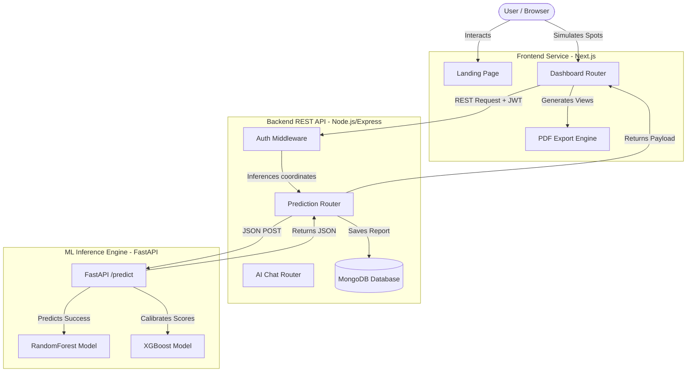

# Architecture Documentation - Business Success Predictor AI

This document specifies the system architecture, service layers, and request workflows for the Business Success Predictor AI platform.

---

## 🏗️ System Components

The application is structured as a decoupled multi-service system:

---

## 🔄 Core Workflows

### 1. Success Prediction Flow
1. **Frontend**: User fills out the business wizard, chooses coordinates on the Leaflet map, and clicks "Analyze Viability".
2. **Backend**: Express validates the JWT token, receives coordinates, and checks the connection to the FastAPI ML service.
3. **ML Service**: 
   - Receives business category, budget, rent, area, staff, expected daily customers, price, and coordinates.
   - Converts coordinates into trigonometric local multipliers.
   - Runs a `RandomForestRegressor` and `XGBoost` model to calculate success probability and risk ratings.
   - Computes demographics population indices, hourly foot traffic curves, and recommended material suppliers.
4. **Backend**: Saves the completed prediction report into MongoDB, logs the audit trail, and returns the document back to the client.
5. **Frontend**: Redirects to the generated report page, displaying interactive Recharts visualization tabs.

### 2. Conversational Chatbot Flow
1. **User** clicks "Consult AI Advisor" from their prediction report.
2. **Frontend** mounts the messaging chat window, fetching past messages from `/chat/history/:id`.
3. **User** asks a question (e.g. "Why is success low?").
4. **Backend** retrieves the corresponding prediction report metrics (budget, rent, competitors score) and passes them to our context-aware business response engine.
5. **Advisor Engine** analyzes cost ratios and competition indices to output targeted, tailored suggestions.
6. **Backend** appends the conversation to MongoDB and updates the client view.

---

## ⚡ Deployment & Scaling Recommendations

- **Monolithic Containerization**: Wrap the Frontend, Backend, and ML Service inside a multi-container Docker Compose layout.
- **ML Caching**: Put Redis in front of the `/predict` route to cache prediction parameters for identical coordinates, saving ML processor cycles.
- **Reverse Proxy**: Use Nginx to handle SSL certificates and route `/api/*` traffic to the backend, and static file requests directly to the Next.js production build directory.
