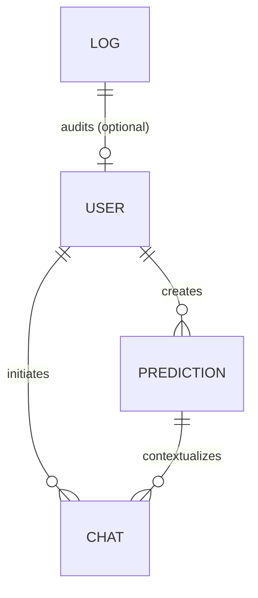

# Database Schema - Business Success Predictor AI

The application utilizes MongoDB to store persistent data for users, location success simulations, conversational chatbot logs, and diagnostic system audits.

---

## 🗄️ Collections Overview

---

## 1. `users` Collection
Stores user account profiles, password credentials, verification statuses, and roles.

| Field | Type | Required | Default / Validation | Description |
|---|---|---|---|---|
| `_id` | ObjectId | Yes | Generated | Unique user identifier |
| `name` | String | Yes | - | User's full name |
| `email` | String | Yes | Unique, lowercase | Profile email address |
| `password` | String | Yes | Hashed (bcrypt) | Encrypted password |
| `role` | String | Yes | `'user'` | Role control: `'user'`, `'admin'` |
| `profilePicture`| String | No | Default Unsplash URL | Profile photo location |
| `isVerified` | Boolean | Yes | `false` | Account active verification |
| `otp` | String | No | `null` | 6-digit verification code |
| `otpExpiry` | Date | No | `null` | Code expiry time (10 min) |
| `createdAt` | Date | Yes | `Date.now` | Registration timestamp |

---

## 2. `predictions` Collection
Stores simulated parameters and ML success model forecasts.

| Field | Type | Required | Description |
|---|---|---|---|
| `_id` | ObjectId | Yes | Unique prediction run ID |
| `userId` | ObjectId | Yes | Reference to the owner (`User` ref) |
| `businessName` | String | Yes | Name of the business simulated |
| `category` | String | Yes | Selected category (Cafe, Salon, Gym...) |
| `budget` | Number | Yes | Total investment budget |
| `shopArea` | Number | Yes | Store area in square feet |
| `rent` | Number | Yes | Monthly rent cost |
| `employeesCount`| Number | Yes | Count of planned staff members |
| `expectedProductPrice`| Number| Yes| Estimated product unit ticket cost |
| `expectedDailyCustomers`| Number| Yes| Target checkout volume per day |
| `description` | String | No | Details about product/offer |
| `goals` | String | No | Target milestones |
| `location` | Object | Yes | Coordinate details: `lat`, `lng`, `address` |
| `scores` | Object | Yes | Model indicators: `locationScore`, `accessibilityScore`, `visibilityScore`, `competitionScore` |
| `demographics` | Object | Yes | Projected population, ageGroups (Map), incomeLevels (Map), occupations (Map), spendingPower |
| `footTraffic` | Object | Yes | Traffic peak distribution values (morning, afternoon, evening, night, weekend, festival) |
| `revenuePrediction`| Object| Yes| Revenue targets: daily, monthly, yearly, monthlyProfit, yearlyProfit |
| `successPrediction`| Object| Yes| Classifier ratings: success probability, riskPercentage, businessScore, investmentScore, growthScore, marketScore, overallRating |
| `recommendations`| Object | Yes | Suggestions: pricing strategy, opening/closing times, break-even months, ROI%, Margin% |
| `suppliers` | Array | Yes | Lists of nearby equipment, raw material, and wholesale vendors |
| `sentiment` | Object | Yes | Regional sentiment score, trending items, customer preferences |
| `events` | Array | Yes | Impact matrices of holidays, sports events, festivals |
| `satellite` | Object | Yes | Road width (m), green space%, development level, parking layout |
| `createdAt` | Date | Yes | Run timestamp |

---

## 3. `chats` Collection
Stores conversational chat histories grouped by prediction card context.

| Field | Type | Required | Description |
|---|---|---|---|
| `_id` | ObjectId | Yes | Unique chat thread ID |
| `userId` | ObjectId | Yes | Reference to user (`User` ref) |
| `predictionId` | ObjectId | Yes | Reference to prediction (`Prediction` ref) |
| `messages` | Array | Yes | Array of message blocks: `{ sender: 'user'\|'ai', text: String, createdAt: Date }` |
| `createdAt` | Date | Yes | Thread creation timestamp |

---

## 4. `logs` Collection
Audits administrative diagnostics and system operations.

| Field | Type | Required | Default / Validation | Description |
|---|---|---|---|---|
| `_id` | ObjectId | Yes | Generated | Unique log event ID |
| `level` | String | Yes | `'info'` | Level tags: `'info'`, `'warn'`, `'error'` |
| `message` | String | Yes | - | Event description details |
| `meta` | Mixed | No | `{}` | Context metadata (ids, emails) |
| `createdAt` | Date | Yes | `Date.now` | Event timestamp |
